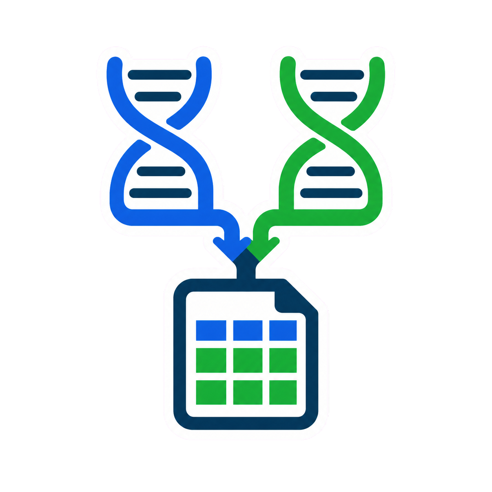
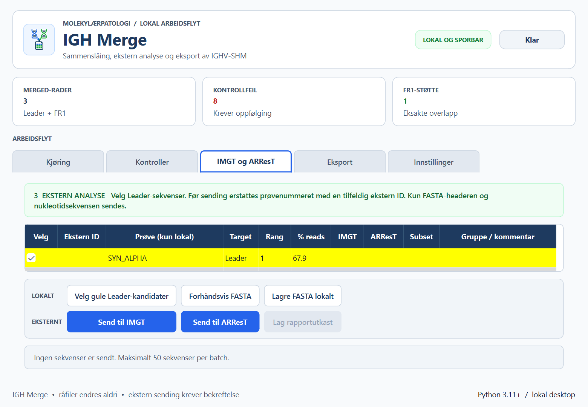

<p align="center">
  
</p>

<h1 align="center">IGH Merge</h1>

<p align="center">
  <strong>Sikker og oversiktlig behandling av IGHV-SHM-resultater</strong><br>
  Norsk PyQt6-applikasjon for merge, kjøringskontroller, IMGT/ARResT-analyse,
  rapportutkast og kompatibel Excel-eksport.
</p>

<p align="center">
  
  
  
  
  
</p>

---



> Skjermbildet bruker utelukkende konstruerte prøve-ID-er og sekvenser.

## Hva appen gjør

IGH Merge samler den manuelle IGHV-SHM-arbeidsflyten i ett lokalt
desktopverktøy. GUI og kommandolinje bruker samme validerte prosesseringskjerne.

| Område | Funksjonalitet |
|---|---|
| **Kjøring** | Oppdager Leader- og FR1-filer, validerer struktur og kobler prøvepar |
| **Kontroller** | Viser kontrollstatus separat for Leader og FR1 |
| **Sekvenskobling** | Finner eksakt FR1-støtte, Leader-varianter og identiske sekvenser mellom prøver |
| **IMGT** | Sender pseudonymisert FASTA og henter den komplette resultatpakken |
| **ARResT** | Henter subset, confidence, score og SeqCure-status |
| **Rapporter** | Lager lokalt rapportutkast og sporbare auditdata per prøve |
| **Excel** | Eksporterer én kompatibel merged-fane med 22 kolonner og valgfri gulmarkering |

## Arbeidsflyt

```text
Kjøringsmappe
     │
     ▼
Valider Leader + FR1
     │
     ├──► Kontroller og sekvenskoblinger
     │
     ├──► Pseudonymisert IMGT / ARResT
     │
     └──► merged.xlsx + lokale rapportutkast
```

1. Velg kjøringsmappen.
2. Valider oppdagede Leader- og FR1-filer.
3. Kontroller kjøringens kontrollstatus.
4. Velg de aktuelle Leader-kandidatene.
5. Forhåndsvis nøyaktig FASTA-payload før eventuell ekstern sending.
6. Kjør IMGT og/eller ARResT etter eksplisitt bekreftelse.
7. Eksporter merged-arbeidsboken og eventuelle rapportutkast.

## Personvern og datasikkerhet

Prosjektet er bygget etter et **local-first**-prinsipp:

- Råfiler, Excel-filer, rapporter og lokale ID-koblinger lagres utenfor Git.
- Råfiler og eksisterende resultatfiler endres aldri av appen.
- Lokale prøvenumre erstattes med tilfeldige eksterne ID-er før IMGT/ARResT.
- Brukeren ser hele FASTA-payloaden og må trykke **Send** for hver tjeneste.
- Returnerte ID-er og sekvenser verifiseres mot den lokale batchen.
- HTTPS-verifisering bruker Windows sitt administrerte sertifikatlager.
- Git-hook og CI-kontroll avviser kliniske filtyper og gjenkjennelige prøve-ID-er.

Kliniske data skal ligge fysisk utenfor repoet, normalt i:

```text
C:\Users\<bruker>\Documents\IGH-data
```

> Sikkerhetsmekanismene i repoet supplerer, men erstatter ikke virksomhetens
> tilgangsstyring, risikovurdering og databehandlerprosedyrer.

## Installer og start

### Vanlig Python-installasjon

Forutsetninger: Windows og Python 3.11 eller nyere.

```powershell
git clone https://github.com/Christian-Bjornstad/IGH.git
cd IGH
python -m pip install -e .
igh-prosess
```

Utviklingsavhengigheter installeres med:

```powershell
python -m pip install -e ".[dev]"
```

Appen kan også startes direkte fra prosjektmappen:

```powershell
.\START_IGH_MERGE.cmd
```

### Python Felles / Ivanti

På administrerte PC-er der `python.exe`, BAT-filer og vanlige snarveier
blokkeres, åpnes **Python Felles** via Ivanti PowerGate-snarveien
(`pwrgate.exe 15694`) og kommandoene limes inn uten `>>>`.

<details>
<summary><strong>Vis installasjons- og startkommandoer</strong></summary>

Dobbeltklikk `INSTALL_IGH_MERGE.cmd` for å installere avhengighetene
første gang og etter hver Python FELLES-oppgradering. Filen er en ren
cmd-/PowerGate-bro som bruker Windows sitt innebygde `clip.exe` til å
legge følgende kommando på utklippstavlen. Den bruker ikke PowerShell:

```python
import runpy; runpy.run_path(r'<prosjektmapp>\install_python_felles.py', run_name='igh_merge_install_felles')['main']()
```

Dobbeltklikk `START_IGH_MERGE.cmd` for å starte appen (samme mønster,
kjører `start_python_felles.py`).

Skriptene er generelle: de bruker `Path(__file__).parent` som prosjektrot
og aldri hardkodede `K:`-stier. Detaljer og loggstier i
[`PYTHON_FELLES_KOMMANDOER.txt`](PYTHON_FELLES_KOMMANDOER.txt).

</details>

## Forventet input

Appen velger automatisk de relevante `top10_searchtop500.tsv`-filene:

```text
YYYY_MM_DD_IGHV/
├── YYYY_MM_DD_LEADER_output/
│   └── SYN_SAMPLE_01_S1_..._read_summary_merged_top10_searchtop500.tsv
└── YYYY_MM_DD_IGH_FR1_output/
    └── SYN_SAMPLE_01_S1_..._read_summary_merged_top10_searchtop500.tsv
```

Valideringen kontrollerer blant annet header, datatyper, dato, prøvenavn,
S-nummer, duplikater og Leader/FR1-par.

## Excel-eksport

Standard output er `YYYY_MM_DD_merged.xlsx` i kjøringsmappen. Eksisterende
filer overskrives aldri uten bekreftelse.

Arbeidsboken inneholder:

- de 13 opprinnelige LymphoTrack-feltene;
- beregnet `Identitet til VH`;
- prøve, reads, target og PCR-dato;
- treff i andre prøver, subset og kommentar;
- ferdig FASTA per rad;
- filter, fryst header og klinisk tilpasset betinget formatering.

Valget **Marker appens gule kandidatrader i Excel** overfører de samme
foreløpige Leader-markeringene fra GUI-et til hele Excel-raden. Valget er av
som standard.

## IMGT og ARResT

- Maksimalt 50 sekvenser sendes per batch.
- Kun valgte Leader-sekvenser inngår i payloaden.
- Gule kandidater har `In-frame=Y`, `No Stop codon=Y` og enten minst 2,5 %
  reads eller eksakt FR1-støtte på minst 2,5 %.
- IMGT bruker human, IGH, D-gene alignment, V-region-indelsøk og subset-søk.
- IMGT-resultatet lagres som komplett resultatpakke, inkludert parametere og
  program-/referanseversjon.
- ARResT-resultatet lagres med subset, confidence, score og SeqCure-status.
- Råresultater og auditdata lagres under `YYYY_MM_DD_external_results`.

### Rapportutkast

Etter fullført IMGT kan **Lag rapportutkast** opprette én lokal PDF per prøve
og `rapportdata.audit.json` under:

```text
YYYY_MM_DD_rapporter\<sesjon>
```

Rapportdata inkluderer blant annet dybde, Leader/FR1-andel, V/D/J-alleler,
VH-identitet, funksjonalitet, CDR3, indels og subset.

## Kommandolinje

```powershell
igh-merge C:\sti\til\YYYY_MM_DD_IGHV `
  --output C:\sti\til\YYYY_MM_DD_merged.xlsx
```

| Valg | Betydning |
|---|---|
| `--expected-samples 24` | Forventet antall prøver per target |
| `--allow-count-warning` | Godta avvik fra forventet prøveantall |
| `--highlight-yellow-rows` | Ta med appens gule kandidatrader i Excel |
| `--overwrite` | Tillat overskriving av eksisterende output |

## Klinisk avgrensning

Appen automatiserer databehandling og presenterer sporbare analyseopplysninger.
Den foretar ikke en endelig klinisk klassifikasjon eller avgjør om en
rearrangering skal rapporteres. Leader er hovedresultat, FR1 er støtte, og alle
resultater skal vurderes etter gjeldende lokal prosedyre.

## Utvikling og kvalitet

```powershell
python -m pytest
python tools/check_no_clinical_data.py --all
```

Testpakken dekker blant annet:

- parsing av lokaliserte tall og ødelagte TSV-filer;
- manglende par, duplikater og naturlig S-sortering;
- FR1/Leader-overlapp og Leader-varianter;
- kontrollgrenser og kandidatmarkering;
- Excel-formler, formatering og sikker overskriving;
- IMGT/ARResT-parsing, TLS-feil og pseudonymisering;
- rapportgenerering og Git-sikkerhetskontroll;
- GUI og Python 3.11/3.14-kompatibilitet.

Alle versjonerte tester bruker syntetiske identifikatorer og sekvenser.

## Prosjektstruktur

```text
IGH/
├── src/igh_merge/          # Prosesseringskjerne, GUI og eksterne tjenester
├── tests/                  # Syntetiske enhets- og integrasjonstester
├── tools/                  # Sikkerhets- og golden-sammenligning
├── docs/                   # Kliniske regler og integrasjonsplaner
├── requirements.txt        # Låste Python Felles-avhengigheter
├── INSTALL_IGH_MERGE.cmd            # Ivanti PowerGate-bro for installasjon
├── INSTALL_IGH_MERGE_INSTALLER.cmd  # Alias-bro (gammelt navn peker hit)
├── START_IGH_MERGE.cmd              # Ivanti PowerGate-bro for start
├── install_python_felles.py         # Generell installasjonslauncher
└── start_python_felles.py           # Generell start-launcher
```

Mer dokumentasjon:

- [Kliniske regler](docs/clinical_rules.md)
- [Plan for IMGT og ARResT](docs/imgt_arrest_plan.md)
- [Designsystem](design-system/igh-merge/MASTER.md)

---

<p align="center">
  <strong>IGH Merge</strong><br>
  Lokal, sporbar og menneskekontrollert IGHV-SHM-arbeidsflyt.
</p>
